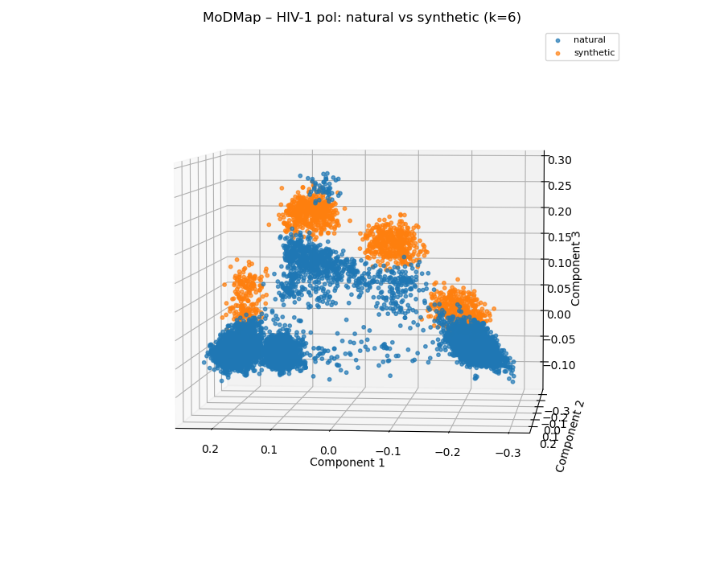
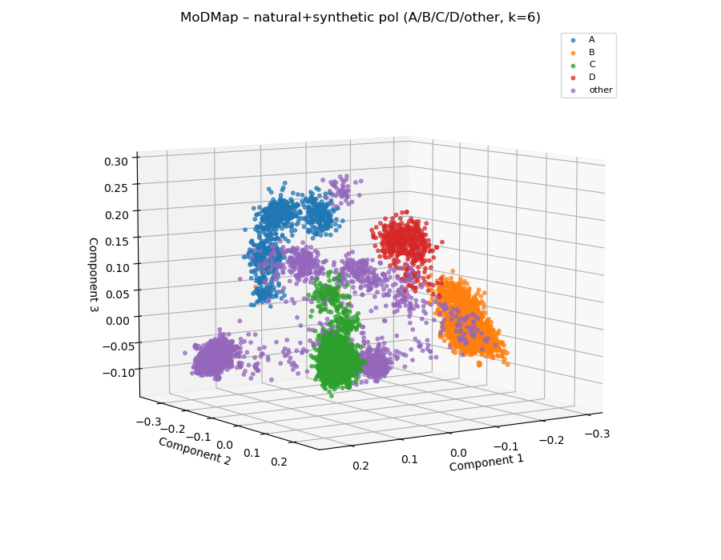
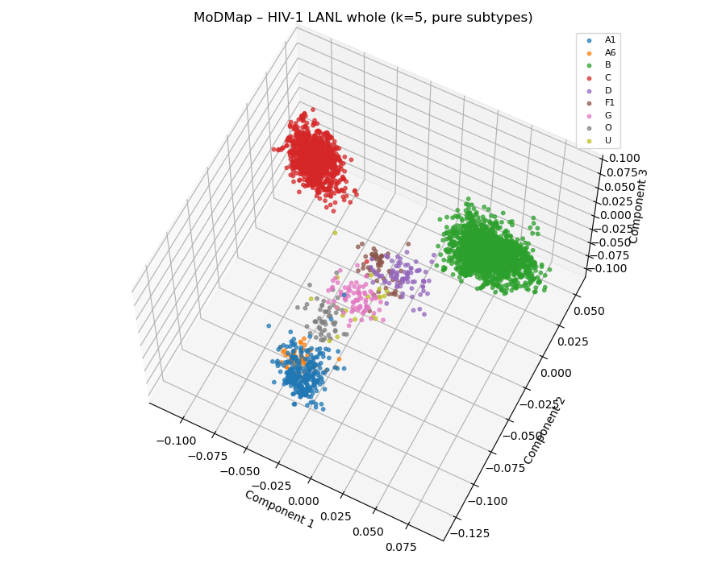
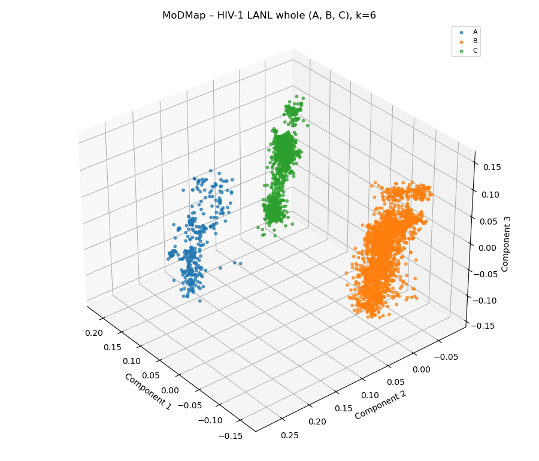
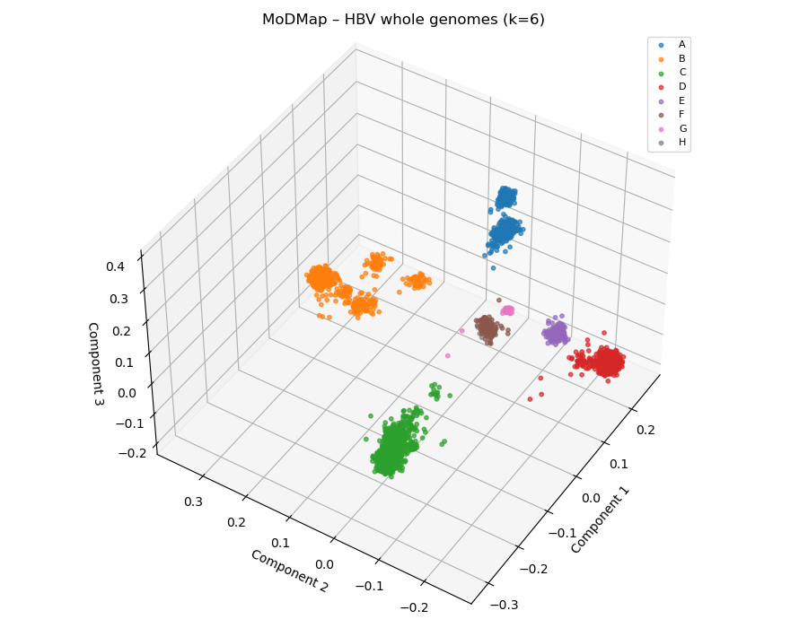

# Pymeris: A python only re-implementation of machine learning experiments for predicting HIV-1 genome subtypes

Wesley Ducharme
November 29th, 2025

## Overview
 
For this project I have reimplemented the methods and experiments done in "An open-source k-mer based machine learning tool for fast and accurate sub-typing of HIV-1 genomes", Solis-Reyes et al. (2018) [1]. In the source paper the authors introduce Kameris, which is an open-source system that uses normalized k-mer frequency vectors paired with machine learning classifiers to perform genome subtype classification for HIV and other diseases. This reimplementation was done fully in python using python libraries such as NumPy, SciPy, Scikit-learn, Pandas and others. The main purpose of Pymeris is to act as a reproducibility test of the methods and results reported in the original Kameris paper [1].

The exact steps of their experiments that I reimplement are as follows:

- k-mer feature extraction.
- Preprocessing by truncated singular value decomposition.
- Their model training pipeline.
- Dataset acquisition and label mappings.
- Supervised classifier training and testing experiment pipeline.
- Unsupervised MoDMap visualization figures.

All outputs / results of the supervised classifier experiments and MoDMap visualization experiments are directly compared to the original paper's results to test for reproducibility by following their describes methods.

## Datasets and experiments

First steps towards reimplementation was obtaining the needed data files they use for their experiments.

For data retrieval, the datasets were fetched and downloaded by running the Kameris jobs outlined in appendix 1 of the source paper [1]. Most of these datasets were obtained originally in the source paper from the Los Almos (Lanl) sequence database in 2017. Please refer to the referenced source paper for more detail on where the raw data was obtained [1]. 

Running each of these jobs yielded the following datasets. The experiments they are used in are also detailed below.

- HIV-1 Whole genomes
    - Acquired by running job 1 in appendix 1 of the paper.
    - Used for the first experiment comparing classifier performance.
- HIV-1 Pol genes
 - Acquired by running job 2 in appendix 1.
 - Used in the second experiment comparing chosen best model performance on whole vs partial genome sequences.
- HIV-1 Benchmark test dataset
    - This dataset is an manually created amalgamation of other HIV-1 datasets from various sources, used to test the best classifier model on separate data.
    - Acquired by running job 3 in appendix 1.
- HIV-1 Pol 2010 
    - Sequences from 2010 Web alignment from the LANL database
    - Acquired this dataset by running the query on the LANL database, which is outlined in the source paper.
    - Where the other datasets were many sequences contained in separate fasta files this data was contained in one single large fasta file.
    - This data was used as the training data for the chosen model before testing said model on the previously mentioned Benchmark dataset.
- HIV-1 Synthetic Pol dataset
    - Acquired by running job 4 in appendix 1.
    - Used in the experiment that tests how well synthetic sequence data models natural data.
- Dengue virus genomes dataset
    - Acquired by running job 6 in appendix 1.
    - This dataset and the hepatitis B, hepatitis C and influenza A datasets were experimented on to test the models applicability to other virus DNA sequencing classifications.
- Hepatitis B genomes dataset
    - Acquired by running job 7 in appendix 1.
- Hepatitis C genome dataset
    - Acquired by running job 8 in appendix 1.
- Influenza A genome dataset
    - Acquired by running job 9 in appendix 1.

All datafiles also came with meta data json files which gave an early mapping of genome sequence fasta files to their subtypes. These meta data files were used to build mappings specific genome sequence by ids to their subtypes to be used in the training pipeline. The label mapping is also where I enforced Kameris's class size rule of dropping subtype classes that had a total count less than 18. This class exclusion rule is in place to help limit the affect of unbalanced classes on training and testing results. By cross referencing the json output file from the labeling with the papers appendix 2 document, it was manually confirmed that each dataset kept the correct number of classes each and that the classes kept matched the papers original results.

As in the Kameris experiments the following subtype class counts were kept for each dataset:
- 25 subtype classes were kept for the HIV whole genome dataset.
- 26 were kept for the HIV Pol dataset.
- 8 were kept for the benchmark dataset.
- 15 were kept for the HiV Pol 2010 Web dataset.
- 5 were kept for the Synthetic Pol dataset.
- 4 classes for dengue.
- 12 classes for hepatitis B.
- 6 classes for hepatitis C.
- 56 subtype classes kept for the influenza A dataset.

This was an important part of the re-implementation that needed to match the original paper's class counts and classes kept as close as possible so that later experiment results could have more valid comparisons.

## Re-implemented methods

All methods outlined in the source paper "An open-source k-mer based machine learning tool for fast and accurate subtyping of HIV-1 genomes", Solis-Reyes et al. (2018) are reimplemented for this project and are summarized as follows. 
Feature vector construction is done by taking the number of possible occurrence of all $4^k$ possible kmers and dividing them by the total length of that sequence [1]. Where for the experiments both this reimplementation and the source paper a k of 6 was chosen for balanced runtimes and performance results. For the purpose of reducing runtimes dimension reduction by truncated singular value decomposition was performed on the feature vectors to reduce vector components down to 10% of the avg number of non-zero entries of the feature vectors [1]. The k-mer frequencies in the feature vector were also scaled to have a standard deviation of 1 to follow with assumptions that some of the classifiers have.

For experiments the next step was to determine what classifier model is best for the task of classifying the the subtype of a virus sequence. This was done by training 15 classifiers on sequences whose subtypes are already known to the learner and then inputs a new sequence whose subtype is unknown and then as output predicts the subtype that the sequence belongs to.

The models tested are:
- 10-nearest neighbors
    - With Euclidean metric and uniform weights
- Nearest centroid mean
    - With Euclidean metric
- Nearest centroid median
    - With Manhattan metric
- Logistic regression 
- Linear SVM
- Quadratic SVM 
- Cubic SVM
- SVM with stochastic gradient descent 
- Decision tree 
    - With Gini
- Random forest
- Adaboost
- Gaussian naive bayes
- Linear discriminant analysis
- Quadratic discriminant analysis
- multilayer perceptron
    - One hidden layer with 100 neurons
    - Relu activation

More details on the parameters used for these classifiers can be found in the source paper [1]. For the experiments both training and test datasets were used but the primary classifier identification experiments 10 fold cross validation was used for the assessment of model performance. In the results section each classifiers 10 fold validation accuracies are reported and compared and the best model selected for later experiments.

Unsupervised methods were also explored in this reimplementation as in the cases where labels may be unknown in datasets, visualizing possible clusters and and potential overlap between sequence subtypes ahead of time can show if adequate separation and identification is possible. For this purpose molecular distance maps, aka ModMaps, were used for these visualizations. As in the source paper, the manhattan distance $d_M(A,B) = \sum_{i=1}^{n} |a_i - b_i|.$
was used to construct a pair wise distance matrix that was then visualized using MDS in a 3d plot. 2d figures of these visualizations are attached in the results section showing these sequence separations.

## Source package

After the datasets were acquired a python package was developed to recreate the original workflow outlined previously in the methods section and in the source paper [1].

This source package handles the following:

1. Feature vector generation. Done in kmer.py.
2. Preprocessing steps such as standardization and then dimensionality reduction performing truncated SVD on the standardized k-mer matrix. Done in preprocess.py.
3. Dataset loading was done by datasets.py.
    - This involved extracting sequence ids from fasta file names or in the case of the HIV1-web-pol-2010 dataset extracted from the single large fasta file.
    - Enforces the papers rule of a certain subtype class being kept only if it has a count greater than or equal to 18 This count is in place to help with balancing classes.
    - Ensures that IDs used for fasta files and the IDs in the respective tsv files match.
4. Model construction for all classifier models is done is models.py with the untrained classifiers being defined here.
5. 10-fold cross validation training and testing pipeline is done in cv.py.
6. Final component of this package is a modmap generation helper program that is used by the the scripts for modmap plot generation.

## Experiment Results

This section will outline the results of the experiments outlined in earlier sections. They like the paper these experiments involves the following procedures. Perform 10-fold cross validation on the hiv1 lanl whole genome dataset training all 15 classifier models outlined above with a k=6. Compiling the accuracy and runtime results in a table that includes the paper's original accuracy metrics. This cross validation process is then repeated for the hiv1 lanl polfragments, Dengue, influenza A, hepatitis B and hepatitis C datasets using only the linear svm model, since it was the best performing classifier. The benchmark experiment follows the papers steps where a linear svm is trained on the hiv1 web pol2010 dataset and then tested on the benchmark dataset of mixed polfragements from an amalgamation of other datasets referenced in the paper to test how a trained model generalizes across datasets. The final supervised model experiment was where testing was done to see if using the linear svm model could distinguish between Synthetic and Natural sequence data.  

| Table 1. Classifier performance on the Whole Genome dataset, Pymeris |
|----------------------------------------------------------------------|

| Model | Mean Accuracy | Std Accuracy | Mean Runtime |
|-------|--------------:|-------------:|-------------:|
| Linear SVM | 96.73% | 0.70% | 504.49s |
| Logistic Regression | 95.77% | 0.69% | 528.44s |
| Multilayer-perceptron | 95.69% | 0.45% | 621.97s |
| LDA | 95.09% | 0.66% | 486.27s |
| Nearest Centroid (median) | 94.34% | 0.61% | 481.16s |
| 10-Nearest Neighbors | 94.07% | 0.64% | 490.24s |
| Nearest Centroid (mean) | 94.05% | 0.63% | 478.93s |
| Decision Tree | 93.75% | 0.67% | 502.90s |
| AdaBoost | 93.54% | 0.83% | 503.10s |
| Cubic SVM | 93.53% | 0.48% | 501.59s |
| Random Forest | 93.30% | 0.49% | 488.69s |
| Quadratic SVM | 92.85% | 0.46% | 504.36s |
| SGD | 88.84% | 6.10% | 481.20s |
| Gaussian NB | 88.49% | 1.05% | 478.67s |
| QDA | 75.51% | 0.47% | 490.52s |

| Table 2. Classifier performance on the Whole Genome dataset, Kameris |
|----------------------------------------------------------------------|

| Model | Accuracy | Mean running time |
|-------|---------:|------------------:|
| cubic-svm | 96.66% | 59.7s |
| quadratic-svm | 96.59% | 58.3s |
| linear-svm | 96.49% | 57.7s |
| multilayer-perceptron | 95.49% | 60.6s |
| logistic-regression | 95.32% | 102.0s |
| 10-nearest-neighbors | 93.97% | 44.3s |
| nearest-centroid-median | 93.95% | 34.0s |
| nearest-centroid-mean | 93.84% | 33.7s |
| decision-tree | 93.53% | 62.3s |
| random-forest | 93.07% | 43.7s |
| sgd | 91.10% | 37.4s |
| gaussian-naive-bayes | 87.75% | 34.0s |
| lda | 77.76% | 36.0s |
| qda | 75.13% | 38.3s |
| adaboost | 64.85% | 159.3s |

Like in the paper the linear svm classifier is a top performer though runtimes across the board are significantly longer. This is due to the fact that they implemented the feature vector computation in C++ where this package is done only in python using libraries like NumPy and SciPy. This was done due to my lack of knowledge of C++ and my familiarity with python. As seen in table there is a significant difference between runtimes as this pure python implementation has a reported runtime 7-8x higher than the paper's for the linear svm model. The linear-svm model is still a top performer with an accuracy of 96.73% which shows a slight improvement over the paper's original reported accuracy of 96.49% [1]. Some other models that show surprisingly significant improvement in performance compared to the original paper are the ada boost and lda models. With all other classifiers showing very similar performance in this reimplementation. I proceed with performing the other experiments outlined in the experiments section using the linear svm model to further verify that these methods work for other datasets as it has proven to be the best well rounded classifier with mid range runtime and the highest reported accuracy.

| Table 3. Generalization experiment performance comparisons |
|----------------------------------------------------------|

| Experiment | Pymeris Accuracy | Kameris Accuracy |
|------------|---------:|-----------------:|
| Hiv1 lanl pol | 95.0% | 95.68% |
| Dengue | 99.98% | 100% |
| Hepatitis B | 94.96% | 95.81% |
| Hepatitis C | 99.94% | 100% |
| Influenza A | 96.65% | 96.68% | 

The results outlined in table 3 show that our methods generalize to other viral datasets well and with high accuracy in the approximately 95% to 99.99% range. Closely mirroring the papers results with the methods showing that more isolated predictions on partial genes like the pol gene retain reasonably high accuracy. High accuracy is retained for subtype classification on sequences from other viruses as well. Averaging in the high 90s for accuracy in the dengue, hepatitis B, hepatitis C and influenza A experiments.

| Table 4. Benchmark and Synthetic vs Natural genome comparisons |
|----------------------------------------------------------------|

| Experiment                           | Pymeris Accuracy | Kameris Accuracy |
|--------------------------------------|------------------|------------------|
| Benchmark test (reimplementation)    | 82.40%       | 94.3%          |
| Synthetic vs natural pol fragments   | 99.98%       | 100%           |

For the benchmark test the reimplementation struggles to match the original 94.3% reported accuracy from the source paper. The possible reasons for this drop in accuracy are elusive and could lie in a problem with the data acquisition of this dataset or simply some other non disclosed or missed method that was performed on this dataset in the source paper. The experiment showing the methods ability to differentiate synthetic from natural pol sequences show very similar results to the outcome of the experiment in the kameris experiments [1]. With results showing that there are some significant differences between synthetic and natural sequences that the linear svm classifier is able to detect. This separation as well as other subtype separations can be visualized using modmap using the unsupervised methods outlined in the methods section above and in the Kameris experiments [1]. 

| Figure 1 a. Natural vs Synthetic HIV-1 pol genes |
|--------------------------------------------------|

| Figure 1 b. Natural vs Synthetic HIV-1 pol genes with defined pure subtypes |
|------------------------------------------------------------------------------|

In the 3d modmap screen shots shown in figures 1a and 2b, it can be seen that synthetic pol genes do cluster separately to a degree that is very significant which explains why the classifier has such a high accuracy when identifying their differences. Due to the nature of machine learning experiments like these it is hard to say for certain what is causing this clear separate clustering, and could be a good point of future study with more transparent methods.

ModMap visuals on other datasets such as the HIV-1 Whole genome dataset and the hepatitis B dataset to visualize the subtype separation and clustering

| Figure 2 a. HIV whole genomes clustering with 9 subtypes |
|----------------------------------------------------------|

| Figure 2 b. HIV whole genomes clustering with 3 isolated subtypes |
|------------------------------------------------------------------|

| Figure 3. Hepatitis B genomes clustering with 8 subtypes |
|----------------------------------------------------------|

As can be seen in the figure 2a the genome sequences in the HIV whole genome dataset show clear separation and reasonably dense clustering for the pure subtypes, which can also be observed more clearly in figure 2b. Similarly clear separation and clustering can be observed for the hepatitis B genome. With some interesting clustering patterns observed for subtypes B and A that could be explored further in a future study. 

These visualizations show that there is in-fact clear defined clustering of subtypes within the datasets we used for our experiments and that the methods practiced here are able to detect these patterns with accuracy very high accuracy.  

## Conclusion

Overall this reimplementation provides evidence that the methods and results done Kameris are both reproducible and yield high performance metrics. It also opens up some possible questions and motivation for future investigation into the Benchmark experiment due to the approximately 12% difference in performance for this reimplementation vs the original paper's findings. Another point of future study that I plan to go into in the near future is to to fine tune a deep learning model and trial its performance on these same experiments in-order to see if a significant increase in overall accuracy is possible with a more fine tuned approach. This is something they mention as well in their own conclusion and I believe it would enhance this project further beyond just recreation. To conclude, the methods and experiments for Kameris are very much reproducible and that Pymeris acts as evidence towards the validity and strength of the work done in the original work.

## References

1. Solis-Reyes, S., Avino, M., Poon, A. and Kari, L. (2018) An open-source k-mer based machine learning tool for fast and accurate subtyping of HIV-1 genomes. PLOS ONE, 13(11), e0206409.